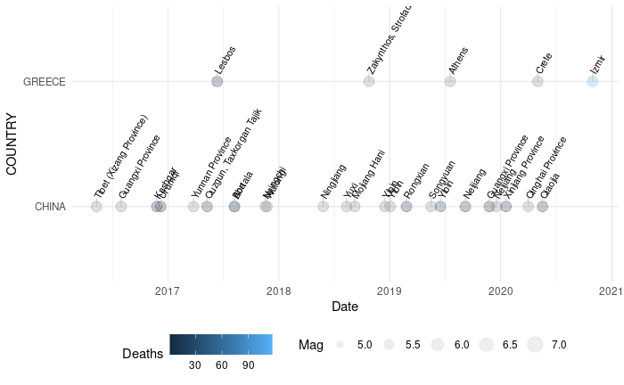
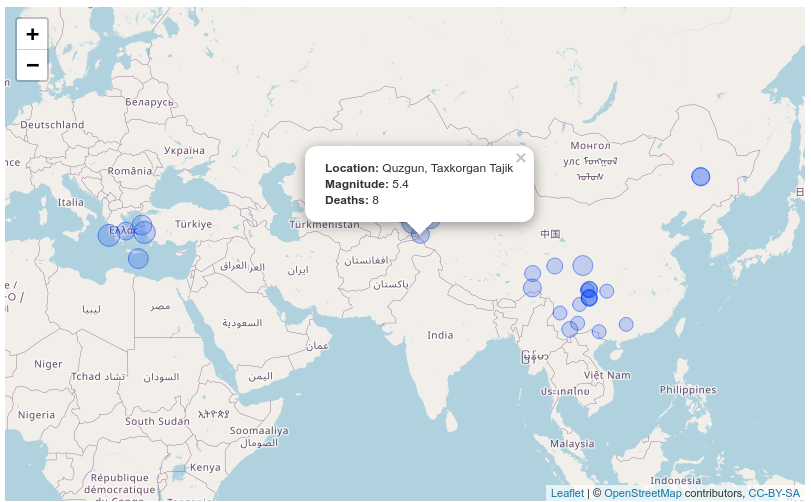

<!-- badges: start -->
  
  <!-- badges: end -->

# MasteringSofwareDevelopmentInRCapstone

This is a final project within the Coursera specialization in R packages. 

Here are some of the products produced with the functions of the package: 

